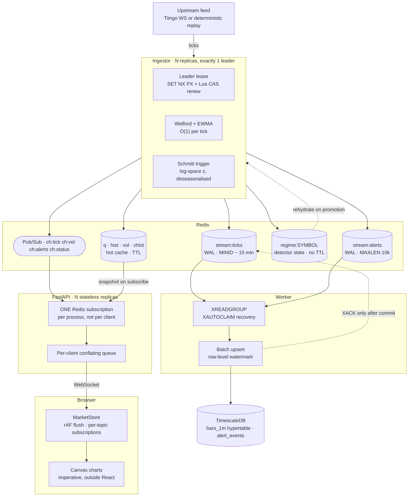

# Live Forex Volatility Tracker

Streaming FX volatility with regime detection. One upstream connection across N
replicas, a Redis write-ahead log in front of TimescaleDB, and a browser that
absorbs 50 messages/second without putting React on the 60 Hz path.

[](LICENSE)


The interesting problems here are not "draw a chart from a WebSocket". They are:

- **Exactly one writer** across N ingestor replicas, with sub-second failover
  that does not lose an in-progress alert.
- **Constant-time volatility** — a sliding window that recomputes is O(n) per
  tick, passes every short test, and degrades only after hours of uptime.
- **Backpressure without unbounded queues**, given that one slow browser must not
  be able to OOM a server shared with everyone else.
- **Alerting that does not storm**, because a z-score hovering at a threshold
  crosses it hundreds of times a minute.
- **A browser main thread that stays under 16.7 ms** while a firehose arrives.

Every claim below has a number or a test behind it. Where something is not
measured, it says so.

**▶ Live demo: https://DEMO-HOSTNAME-HERE** — the real stack, streaming now. No
signup, no API key. Two ingestor replicas, one holding the lease.

---

## Run it

```bash
git clone https://github.com/<you>/live-forex-volatility-tracker
cd live-forex-volatility-tracker
cp .env.example .env
docker compose up -d
```

Then open `http://localhost:5173` — these are addresses on **your own machine**,
live only while the stack above is running. The hosted demo is the link at the
top of this page.

The default provider is `replay` — a deterministic synthetic feed whose
per-minute realised volatility is exactly what it claims — so nothing above
needs an API key or a market-data vendor. Set `FX_PROVIDER=tiingo` and
`FX_PROVIDER_TOKEN=...` for a live feed.

| Surface | Local address |
|---|---|
| Dashboard | `http://localhost:5173` |
| REST + OpenAPI | `http://localhost:8000/docs` |
| Live stream | `ws://localhost:8000/ws/stream` |
| Readiness | `http://localhost:8000/readyz` |
| Prometheus | `http://localhost:9090` |
| Grafana | `http://localhost:3000` |

Append `?perf=1` to the dashboard for a frame-timing overlay: long tasks, dropped
frames, observed fps, and the store's conflation counters.

<details>
<summary><strong>Troubleshooting <code>compose up</code></strong></summary>

**Code changes do not show up.** Nothing is bind-mounted — every service runs
from a built image, so `up -d` on an existing image restarts the *old* binary
without saying so. After editing source or pulling:

```bash
docker compose up -d --build
```

This bites hardest on the ingestor, because a stale one still serves plausible
data: the dashboard keeps drawing prices while the header goes `Stale`. Confirm
which code is actually running by watching the feed heartbeat advance — `ts` is
re-stamped every 5s, so two reads a few seconds apart must differ:

```bash
docker compose exec redis redis-cli GET feed:status; sleep 6
docker compose exec redis redis-cli GET feed:status
```

A frozen `ts` on a container that is streaming means the image predates the
heartbeat — rebuild. See `tests/unit/test_feed_heartbeat.py`.

**`Bind for 0.0.0.0:8000 failed: port is already allocated`** — something else on
the machine owns that port. Find it and stop it, or remap in
`docker-compose.yml`:

```bash
# Linux/macOS
lsof -i :8000 -i :5173
# Windows PowerShell
Get-NetTCPConnection -LocalPort 8000,5173 | Select-Object LocalPort, OwningProcess
```

Only `8000` (API) and `5173` (dashboard) are published on all interfaces. Redis,
PostgreSQL and the worker's metrics port bind to `127.0.0.1` only, and the
ingestor publishes nothing — it runs two replicas, and a fixed host port on a
scaled service is a guaranteed collision. `tests/unit/test_compose.py` enforces
that.

**`docker compose up -d` exits non-zero and the dashboard never appears.** Compose
aborts the whole run on the first container that fails to start, and `web` is
last in the dependency graph — so a failure anywhere upstream shows up as
"localhost:5173 does not load". Read the actual error rather than the symptom:

```bash
docker compose ps -a        # which container is not running
docker compose logs --tail=50 <service>
```

**Ingestor metrics.** No host port by design; reach a replica directly with:

```bash
docker compose exec ingestor python -c \
  "import urllib.request;print(urllib.request.urlopen('http://127.0.0.1:9100/metrics').read().decode()[:400])"
```

Or start the observability profile and use Prometheus, which discovers both
replicas by DNS:

```bash
docker compose --profile observability up -d
```

</details>

### Hosting it yourself

`docker-compose.prod.yml` is the public profile: Caddy terminating TLS in front
of the same web image, no database, nothing published but 80 and 443. It runs on
a free-tier ARM box — [docs/deploy-oracle.md](docs/deploy-oracle.md) is the
runbook, including the two firewalls Oracle makes you open and the one you
probably don't.

Local development, the four test tiers and the contribution conventions are in
[CONTRIBUTING.md](CONTRIBUTING.md).

---

## Architecture



Three things in that diagram are the design, not decoration.

**The WAL sits between ingest and persistence**, so a worker crash costs nothing:
entries stay in the pending list until a commit succeeds, and `XACK` happens
after Postgres, never before.

**One Redis subscription per API process, not per browser.** Five hundred clients
across three replicas is three Redis connections. The naive design — a
subscription per browser — puts 500 connections on Redis and falls over well
before that.

**Snapshot-then-delta on subscribe**, served entirely from Redis. A wave of
reconnects after a deploy cannot become a wave of database queries at the exact
moment the system is already stressed.

---

## Fault tolerance and design decisions

### 1. Leader-elected write-ahead log

One writer, elected by a Redis lease (`SET NX PX` plus a Lua compare-and-swap on
renewal). It is a **lease, not consensus** — deliberately, and
[ADR-0001](docs/adr/0001-leader-lease-not-consensus.md) states the Kleppmann
critique it does not defeat. What it buys is single-writer semantics with a 10 s
TTL and no Raft in a portfolio project; what it costs is a fencing guarantee we
do not need because the WAL is idempotent downstream.

Detector state (`regime:SYMBOL`) is written on **every sealed bar**, not on a
timer, and carries no TTL. Both of those are load-bearing:

- A promoted standby that starts cold re-baselines on whatever the market is
  doing *right now*. Mid-crisis, it learns the crisis as normal, reports NORMAL
  for the rest of the event, and never emits the clear that the stored `stressed`
  row is waiting for. The chaos suite measures this. We had assumed the failure
  mode would be a *duplicate* escalation, which would have been the kinder bug —
  the control arm failed to reproduce it and the real behaviour turned out to be
  silent.
- The diurnal profile takes days of samples to learn, so an expiry during a quiet
  weekend would silently cost days of alerting quality for ~1 KB per symbol.

That last point forces the eviction policy. `maxmemory-policy` is a **server**
directive, not per-database, and under `allkeys-lru` Redis evicts a whole stream
key at once — it does not politely trim your WAL, it deletes it along with every
unacknowledged tick. So the invariant is `volatile-lru` plus *keys with a TTL are
disposable, keys without one are durable*. It is asserted statically in
`tests/unit/test_resilience.py` and against a real Redis in
`tests/integration/test_redis_pipeline.py`. See
[ADR-0002](docs/adr/0002-redis-eviction-policy.md).

Exactly-once *effect* comes from a row-level `last_stream_id` watermark on bars
and a `UNIQUE (symbol, seq)` constraint on alerts — at-least-once delivery
collapses to the same row.
[ADR-0005](docs/adr/0005-row-level-watermark-idempotency.md),
[ADR-0009](docs/adr/0009-alert-idempotency-and-seq-collision.md).

### 2. O(1) volatility maths

Welford's algorithm for streaming variance, EWMA/EWMV for the decayed estimate,
bucket accumulation for OHLC. Constant work per tick, constant memory, no
recomputation over a window.

The measured ratio between the first 100k ticks and the next 900k is what makes
that a claim rather than an assertion — see [Performance](#performance). A naive
window is the worst failure shape there is: it passes every short test and only
shows up in production after a few hours.

Five estimators ship side by side — close-to-close, Parkinson, Garman-Klass,
Rogers-Satchell, Yang-Zhang — because the spread between them *on identical bars*
is the argument for range estimators. Every σ carries its estimator, window and
annualisation basis; an unlabelled σ could be per-tick, per-minute or annualised,
and a finance-literate reviewer checks for exactly that.

Two subtleties that only surfaced under test:

- **The fast signal must be separated from the baseline.** The numerator is one
  sealed bar's realised volatility; the denominator is a ~120-bar EWMA baseline.
  Feed the rolling window into both and they move together and z collapses.
  `assert_separated_from` turns that from a silent statistical failure into a
  startup crash with an explanation.
- **Seasonality has to be time-of-*day*, not time-of-*measurement*.** The first
  implementation kept a global level as an EWMA over arrival order, so it was
  dominated by whichever hours arrived last. The reference is now the mean of the
  learned hour buckets, balanced by construction. The test oracle was wrong too —
  arithmetic where it should have been geometric — and both were corrected.

### 3. Conflation as backpressure

A slow client must not be able to grow a queue. Each connected session holds a
**map keyed by `(kind, symbol)`**, not a list: a superseded price is a stale price
nobody wants, so the newest value overwrites in place and memory is bounded by
*subscribed symbols* rather than by message rate.
[ADR-0006](docs/adr/0006-conflation-for-backpressure.md).

Conflation is a property of the **data**, not a general mechanism, and the
exception matters: **alerts are never conflated.** "We escalated at 14:03" is not
made redundant by "we cleared at 14:31", and a client that only ever saw the
clear would have no idea anything happened. Transitions get their own slot keyed
by `seq`.

The browser mirrors the same idea. `MarketStore` holds market state outside React
entirely: ticks land in a plain `Map` and one `requestAnimationFrame` flush
notifies per-topic subscribers, so a EURUSD tick wakes the EURUSD cell and not the
tree. Every `getSnapshot` accessor returns a **stored reference and never
allocates** — returning a fresh object or a `.filter()` result makes React see a
new value on every read and re-render forever — and the store suite pins that with
identity assertions rather than trusting the discipline.

> **Edge case: the rAF feed freeze.**
> The flush runs inside a `requestAnimationFrame` callback, which is outside
> React's call stack — **no error boundary can reach it.** An uncaught throw from
> one chart's tick listener abandoned the buffer mid-drain, skipped the notify
> entirely, and left every *other* symbol's UI frozen until the next tick happened
> to arrive. One broken chart taking down the whole terminal by the single route
> the error boundaries structurally cannot cover. Listeners are now isolated
> per-callback with a `painterErrors` counter, and the error boundaries handle the
> render-path failures they *can* catch.

The rAF loop is also armed only when there is work. Re-arming unconditionally
costs 60 wakeups/second through a closed weekend for zero output.

### 4. Jittered backoff, on both sides of the wire

```
sleep = uniform(0, min(cap, base × 2^attempt))
```

Full jitter (AWS Architecture Blog), used by the ingestor against the upstream
provider **and** by the browser against our own API — because when the API
restarts, every open tab reconnects at once, and the browser is a client of our
infrastructure exactly as we are a client of Tiingo's. Plain exponential backoff
synchronises every client on Earth onto the same instant and re-downs the service
they were waiting for.

Behind it: a staleness watchdog (a dead socket and a quiet market are byte-for-byte
identical, and TCP will hold a black-holed connection open for minutes) and a
circuit breaker that publishes `degraded` so the UI can say *"data delayed"*
instead of rendering stale prices as though they were live.

> **Edge case: the reconnect DDoS.**
> `attempt = 0` ran on *any* clean return from the connection loop, before the
> next delay was computed — so `delay(attempt)` was always `delay(0)`. A session
> that lasted four hours and one the server closed in four milliseconds were
> treated identically, and the ladder never escalated on the clean-disconnect
> path. A provider that accepts the socket and hangs up — at capacity, load
> balancer draining, authenticated but not entitled — got hammered at roughly
> **four reconnects per second, indefinitely.** The circuit breaker could not
> intervene either, because `record_success()` fired on *connect*, so it saw an
> unbroken run of successes. A session now has to survive
> `MIN_HEALTHY_SESSION_S` before it resets the ladder or closes the breaker;
> `tests/unit/test_reconnect_ladder.py` fails against the old behaviour.

---

## Failure-mode matrix

Every row has a branch in the code and a test in `tests/chaos/` or
`tests/integration/`.

| What fails | Detected by | Behaviour | Data lost | Recovery |
|---|---|---|---|---|
| Upstream drops the socket | immediately | full-jitter backoff; breaker counts a failure; status `degraded` | none in flight | automatic |
| Upstream accepts then hangs up | session < 30 s | ladder escalates, breaker opens after 5 | none | half-open probe after 30 s |
| Upstream silent, socket open | staleness watchdog, 30 s | detector gated *before* teardown, forced reconnect | ticks that never arrived | automatic |
| Upstream returns 401 | immediately | **no retry**, status `fatal`, exit 78 (`EX_CONFIG`) | n/a | operator |
| Market legitimately closed | `fx_core.calendar` | watchdog stands down; banner is neutral, not an error | none | Sunday 17:00 NY |
| Leader ingestor killed | lease TTL, 10 s | standby promotes and **rehydrates the detector** from `regime:*` | ticks during the gap | ≤ 10 s |
| Redis unavailable | ping / write failure | ingest fails loudly; `/readyz` → 503; browser shows Disconnected | ticks during the outage | automatic |
| Worker killed mid-batch | pending idle > 60 s | a survivor `XAUTOCLAIM`s the backlog | **none** — WAL holds 15 min | ≤ 60 s |
| Postgres unavailable | commit raises | worker does **not** `XACK`; entries stay pending and retry | none while the WAL retains | automatic |
| API replica killed | socket closes | browser reconnects with full jitter to another replica | none — snapshot-then-delta | seconds |
| Browser cannot keep up | queue saturated > 10 s | conflate, then close `4003` | superseded prices only | client reconnects |
| Tab backgrounded | rAF stops firing | buffer conflates; client unsubscribes to save bandwidth | none | on focus |
| A chart component throws | React error boundary | that pane shows a failure state; the rest of the terminal lives | none | "Try again" |
| A tick listener throws | try/catch inside the flush | that chart stops painting; feed and other symbols unaffected | none | counted in `painterErrors` |
| Malformed client frame | pydantic validation | error frame, then close `4000` | none | client reconnects |
| Ticket invalid or replayed | `GETDEL` returns nil | close `4001` | n/a | request a new ticket |

---

## Performance

Reproduce with `make bench` (`uv run pytest tests/load -m load -s`) and
`cd apps/web && npx vitest bench --run`. Recorded numbers and the full method are
in [docs/benchmarks.md](docs/benchmarks.md).

Environment: 1 vCPU container, Python 3.11, Redis 7, PostgreSQL 16. **Absolute
values will differ on your machine; the ratios are the claim**, and they are what
the assertions check.

### Backend

| Property | Measured | Why it matters |
|---|---|---|
| Volatility hot path, first 100k ticks | **801 ns/tick** | |
| Volatility hot path, after 900k ticks | **788 ns/tick** | ratio **0.98×** — flat, i.e. O(1). An O(n) window climbs without bound and degrades only after hours of uptime |
| Sustainable rate implied | **~1.2 M ticks/s** on one core | upstream delivers 10–50/s; the maths will never be the bottleneck |
| Conflation under a firehose | 200,000 updates → **5 entries** held | memory bounded by *subscribed symbols*, not message rate; a naive queue holds 200,000 |
| Publish throughput | **1,506 k/s** | |
| Fan-out to 500 clients, 450 of them not reading | p50 **312 µs** · p99 **533 µs** | no client blocks the loop; in the naive `await ws.send_json()` design this figure is whatever the slowest client's network decides |
| Replay provider | **840/s** against a 2,000/s target | shortfall is `asyncio.sleep()` granularity, not the pipeline — stated rather than quietly reported as 2,000 |

Run-to-run variance on a shared 1-vCPU container is real: the O(1) ratio has been
observed between **0.98× and 1.16×** across runs. The assertion has headroom for
that, because a benchmark you cannot reproduce is worse than no benchmark.

### Frontend — one second of feed through the store

The frame budget is 16.7 ms and the store is one tenant of it.

| Scenario | Mean | p99 | % of one frame |
|---|---|---|---|
| 50 ticks across 5 pairs, 1 subscriber each | **2.0 µs** | 3.5 µs | **0.012 %** |
| 500-tick burst conflated into a single frame | **9.7–12.0 µs** | 38.6 µs | **0.058–0.072 %** |
| 50 ticks with 100 subscribers | **7.7 µs** | 38.9 µs | **0.046 %** |

Ten times the messages costs roughly four times the work, not ten. Conflation
collapses a burst to one entry per symbol regardless of its size, and that
sub-linearity is the property worth quoting — the absolute figures are small
enough to be uninteresting on their own.

### Not measured yet

Listing the gaps is part of the benchmark.

- **End-to-end p99, provider timestamp → browser paint.** The ingest half is
  wired (`fx_ingest_lag_seconds`); the browser half needs a `performance.mark()`
  round trip. This is the headline number and publishing it before measuring it
  properly would be dishonest.
- **Multi-hour soak.** The O(1) result *predicts* flat memory and CPU. That
  prediction is untested beyond a million ticks.
- **Postgres write ceiling under a real firehose.** The batched upsert is verified
  correct; its throughput limit is unknown.

---

## Regime detection

A Schmitt trigger over a log-space z-score. Two thresholds, not one: fire high,
clear low, so a signal hovering at a boundary cannot produce an alert storm.
Borrowed from analogue electronics, where the problem was solved in the 1930s.

```
z ≥ enter_z  →  NORMAL becomes STRESSED
z ≤ exit_z   →  STRESSED becomes NORMAL
in between   →  whatever we already were
```

Four properties that separate this from a threshold in a `for` loop:

- **Symmetric confirmation.** Firing requires N samples *and* a wall-clock
  duration; so does clearing. Noise protection that guards only one direction is
  not noise protection — a single low print mid-crisis used to disarm the alert.
- **Log space.** Realised volatility is lognormal (Andersen, Bollerslev, Diebold &
  Labys 2001), so the baseline is an EWMA/EWMV over `log σ`. A z-score on raw σ
  is a z-score on the wrong distribution.
- **Deseasonalised.** 24 hour-of-day multiplicative factors, learned online
  (Andersen & Bollerslev 1997). Without it the London open is permanently
  "stressed" and 3 a.m. never is.
- **A frozen baseline under stress, with a bounded thaw.** Volatility clusters
  (Mandelbrot 1963), so a baseline that keeps learning during an event
  normalises the event away. Freezing it forever is also wrong, so after
  `thaw_after` the level is accepted as the new normal — and the transition is
  recorded with cause `baseline_thaw` rather than `threshold`, because "back to
  normal" means three completely different things and only one of them is a
  statement about the market.

Every transition is written to Postgres with its cause, trigger value, threshold
and a human-readable reason. The alternation invariant (`NORMAL → STRESSED →
NORMAL`) is enforced in the state machine and asserted in SQL.

---

## Testing

394 tests across five tiers. Real Redis and real PostgreSQL for anything that
depends on their semantics — mocking consumer-group pending lists, `XAUTOCLAIM`
idle windows or `MINID` trimming would mean asserting our own assumptions back at
ourselves.

| Tier | Count | Needs | CI |
|---|---|---|---|
| Backend unit | 130 | nothing | every push |
| Backend integration | 76 | Redis, PostgreSQL | every push |
| Backend chaos | 19 | Redis, fault-injection server | every push |
| Backend load | 4 | Redis | nightly |
| Frontend | 165 | jsdom | every push |

Coverage: **81 %** Python across all four packages, **92 %** TypeScript. Both are
gated (`fail_under = 60`, vitest thresholds) as ratchets — raised when the number
goes up, never lowered to make a build pass.

**Service-dependent tests fail rather than skip in CI.** `FX_REQUIRE_SERVICES=1`
turns an unreachable Redis from a silent skip into a build failure, because a
container that fails its health check would otherwise reduce the suite to the unit
tier and the badge would stay green over 95 tests that never ran. That guard has
already caught a real outage during development.

The suite has been **mutation-tested**: load-bearing guarantees were deliberately
broken to confirm the tests fail. That exercise found a weak test — a z-pane
assertion that passed for the wrong reason — which was retightened to a value that
actually discriminates. A suite that has been attacked by its own author is worth
more than one that has only ever been run in the happy direction.

Accessibility is tested, not asserted: axe on the assembled page (not just
components, which is how a landmark defect once shipped), WCAG contrast ratios
computed numerically from the design tokens because jsdom silently skips
colour-contrast checks, shape-plus-colour encoding for every regime, roving
tabindex, and WCAG 2.2.1 timing behaviour on alert toasts.

---

## Layout

```
packages/core/fx_core/      dependency-free domain: volatility, alerts, calendar
packages/platform/          logging, Redis client, metrics
apps/ingestor/              provider adapters, leader lease, pipeline, supervisor
apps/worker/                stream consumers, batch persistence
apps/api/                   FastAPI, WebSocket gateway, conflation, rate limiting
apps/web/                   React, Lightweight Charts, MarketStore
infra/migrations/           TimescaleDB schema
docs/adr/                   nine architecture decision records
tests/{unit,integration,chaos,load}/
```

`fx_core` has no I/O and no framework dependency, which is why the maths and the
state machine are unit-testable without Redis, Postgres or a network.

---

## Design decisions on record

| ADR | Decision |
|---|---|
| [0001](docs/adr/0001-leader-lease-not-consensus.md) | A Redis lease, not consensus, for single-writer election |
| [0002](docs/adr/0002-redis-eviction-policy.md) | `volatile-lru` with a TTL invariant, not `allkeys-lru` |
| [0003](docs/adr/0003-welford-over-naive-variance.md) | Welford's algorithm for streaming variance |
| [0004](docs/adr/0004-asyncio-not-celery.md) | Asyncio consumer for stream draining |
| [0005](docs/adr/0005-row-level-watermark-idempotency.md) | Row-level stream-id watermark for exactly-once effect |
| [0006](docs/adr/0006-conflation-for-backpressure.md) | Conflating per-client queues instead of buffering |
| [0007](docs/adr/0007-timescaledb-vs-supabase.md) | Self-hosted TimescaleDB by default; Supabase via `pg_partman` |
| [0008](docs/adr/0008-why-not-kafka.md) | Redis Streams, not Kafka |
| [0009](docs/adr/0009-alert-idempotency-and-seq-collision.md) | `(symbol, seq)` as the alert idempotency key |

---

## API

| Method | Path | Notes |
|---|---|---|
| `GET` | `/api/market/status` | Session state, next open/close |
| `GET` | `/api/bars/{symbol}` | Sealed bars from the Redis hot cache |
| `GET` | `/api/volatility/{symbol}` | One estimator, labelled with its basis |
| `GET` | `/api/volatility/{symbol}/compare` | All five estimators over identical bars. Rate limited, 30 s cache |
| `POST` | `/ws/ticket` | Single-use 30 s WebSocket ticket |
| `WS` | `/ws/stream` | `subscribe` / `unsubscribe` / `ping`; snapshot then deltas |
| `GET` | `/healthz` `/readyz` | Liveness checks nothing external; readiness checks Redis and feed age |

The browser `WebSocket` constructor cannot set request headers — that is the
spec, not an oversight — so authentication happens over ordinary HTTP and returns
a single-use ticket redeemed at the handshake with `GETDEL`. A leaked ticket is
already expired and already spent.

Security posture, defaults and known limitations: [SECURITY.md](SECURITY.md).

---

## Status

Milestones 0–2 complete: architecture and vertical slice, regime detection wired
end to end, frontend with four regime visualisations. The known gaps are recorded
rather than hidden — see *Not measured yet* above, plus browser-level end-to-end
tests, which are the next piece of work.

## License

[Apache-2.0](LICENSE). Contributions welcome — see
[CONTRIBUTING.md](CONTRIBUTING.md) and
[CODE_OF_CONDUCT.md](CODE_OF_CONDUCT.md).
